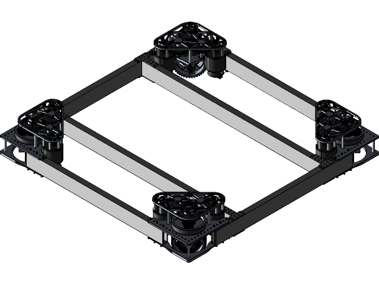

Mechanisms are essential components of what makes a robot function. Every year to adapt and solve challenges we pivot to utilizing a combination of unique mechanisms in hopes of efficiently completing tasks associated with the annual FRC challenge. Mechanisms are essentially a combination of components that provide a functionality to a robot. So during competitions, you would see every bot has mechanisms that help it function like claws, arms, intakes etc. Basically a mechanism is just a subassembly of the robot. Examples include, drivebase, shooters, intakes, elevators, climbers, all the stuff.

> Great resource for mechanism information: [https://www.projectb.net.au/resources/robot-mechanisms/#DT](https://www.projectb.net.au/resources/robot-mechanisms/#DT) 

It is important to understand these mechanisms and how they work, this way we can understand when to use them and when not to or which are most useful in which situations. We will be able to make the best decisions when designing and prototyping a robot for the annual challenge as well.

---

## Drivetrains

### **Tank**

* Strengths:
  * Great pushing power
  * Strong traction
* Weaknesses:
  * Low maneuverability
* West Coast Drives (Subset of Tank)
  * 6 wheels
  * Better at traversing terrain

Tank drives are older common drivetrains that you would rarely be seen in competitions nowadays. It is a classic and highly reliable drivetrain featuring independent left and right wheel chains. Our team rarely uses the tank drive system anymore due to the lack of maneuverability and speed. The tank drivetrain is the simplest to build and consists of two tracks with wheels on each side. The robot's movement is determined by how much power is delivered to each track on the robot. If equal power is sent to both tracks the robot will drive forward or backward. If more power is sent to the left side, the robot will turn right, more power to the right will turn the robot left.

Please refer to this link to learn **how to program** advanced tank drivetrains: [Software Guide](https://compendium.readthedocs.io/en/latest/tasks/drivetrains/drivetrains.html)

### **Mecanum**

* Strengths:
  * Goes in all directions
    * Due to the Diagonal wheels
* Weaknesses:
  * Low traction
  * Gets pushed around easily

Mecanum drives feature the mecanum wheels which is an omnidirectional wheel design for a land-based vehicle to move in any direction. It is commmonly seen in other robotics programs such as VEX but you will never really see it being used in the FRC program. With large robots that require efficient and high maneuverability the mecanum system is not the right fit and can cause many problems when driving the robot in competition and against other teams. Our team has never used this system to my knowledge.

### **Swerve**

* Strengths:
  * Easily designed around
  * Good pushing power 
  * Good grip
  * Good maneuverability 
* Weaknesses:
  * Harder to code
  * Can drag on the carpet

The Swerve in the most common nowadays as it offers high maneuverability and can go in all directions. It is essentially the best system that the majority of top teams utilize. It is faster than all the other systems but can cause a lot of problems with getting stuck and dragging on the carpet. The swerve modules are usually premade delivered in kits and assembled by mechanical members. At this point of time we use the [MK4i swerve module](https://www.swervedrivespecialties.com/products/mk4i-swerve-module). The swerve modules conventionally placed at the four corners on the bot.

  <iframe 
    src="https://docs.google.com/presentation/d/1G649kalPjeWhCZFZfVIztVIpZ2SMBBMLTMHcvtFYvjc/embed?start=false&loop=false&delayms=3000&rm=minimal" 
    style="position: absolute; top: 0; left: 0; width: 100%; height: 100%; border: 0;" 
    allowfullscreen="true">
  </iframe>

